<p align="center">
  <picture>
    <source media="(prefers-color-scheme: dark)" srcset="https://capsule-render.vercel.app/api?type=waving&color=0:1a1a2e,100:d4af37&height=200&section=header&text=WORKPLUS&fontSize=60&fontColor=d4af37&animation=fadeIn&fontAlignY=35">
    
  </picture>
</p>

<div align="center">

# WorkPlus

### *Sua plataforma inteligente de busca e gestão de vagas tech*

[](https://python.org)
[](https://fastapi.tiangolo.com)
[](https://nextjs.org)
[](https://react.dev)
[](https://www.typescriptlang.org)
[](https://mongodb.com)
[](https://tailwindcss.com)
[](https://docker.com)

[]()
[]()
[]()

> WorkPlus centraliza vagas de tecnologia de 12 fontes, aplica match score por IA local e organiza tudo em um pipeline kanban — coleta, analisa e acompanha oportunidades sem você precisar visitar dezenas de sites manualmente.
>
> ⚠️ O WorkPlus **não envia currículos, não preenche formulários e não se candidata automaticamente**. Todo o processo de aplicação é manual e intencional, feito diretamente no site de cada empresa. O sistema cuida da etapa anterior: a inteligência de mercado, a triagem e a organização — para que você chegue ao momento de aplicar já com informação suficiente para decidir se aquela vaga vale seu tempo.

[⚡ Quick Start](#-quick-start) •
[🧠 Features](#-features) •
[📡 Fontes](#-fontes) •
[🏗️ Arquitetura](#️-arquitetura) •
[🖥️ Interface](#️-interface) •
[🛠️ Stack](#️-stack)

---

</div>

## 📋 Sobre o Projeto

O WorkPlus é uma plataforma pessoal de busca e gestão de vagas de tecnologia, construída para automatizar todo o processo de encontrar, avaliar e acompanhar oportunidades de emprego. Em vez de visitar dezenas de sites manualmente, o sistema faz isso de forma contínua em segundo plano e entrega apenas as vagas mais relevantes, já analisadas e pontuadas.

### Coleta de Vagas

O sistema acessa **12 fontes diferentes** — incluindo APIs públicas de plataformas de recrutamento, portais de emprego e sites de carreira corporativos. Após a coleta, as vagas passam por:
- Deduplicação (evita repetições entre fontes)
- Filtragem de relevância (baseada no perfil do usuário)
- Filtragem geográfica (apenas vagas brasileiras)
- Extração automática do modelo de trabalho (remoto, híbrido, presencial) e estado (UF)

### Pontuação e Análise

Cada vaga recebe automaticamente uma **pontuação de 0 a 100** calculada com base em título, stack tecnológica, salário, tipo de contrato, localização e reputação da fonte. O sistema também detecta automaticamente vagas "fake júnior" — aquelas com título de nível júnior mas que exigem experiência de sênior na descrição.

Para vagas de interesse, uma análise mais profunda pode ser solicitada via IA, gerando resumo da oportunidade, nível de senioridade real, stack principal estimada, score de compatibilidade personalizado e sugestões de desenvolvimento.

### Gestão de Currículo

- Upload de currículo em **PDF ou DOCX**
- Extração automática via IA para montar perfil estruturado (habilidades, experiências, preferências)
- Perfil calibra os scores de match e os termos de busca das coletas
- **Versionamento completo**: múltiplas versões, histórico de alterações, restauração e exportação

### Notificações

| Tipo | Gatilho | Canal |
|------|---------|-------|
| Alerta de vaga | Score ≥ 85 | Telegram (link direto) |
| Resumo diário | Todos os dias às 8h | Telegram (melhores vagas do dia anterior) |

---

## 🧠 Features

| | Feature | Descrição |
|:-:|---------|-----------|
| 🤖 | **Coleta de Vagas** | Busca manual em diversas fontes com um clique — você decide quando iniciar |
| 📊 | **Match Score IA** | Pontuação 0-100 por título, stack, salário, tipo, localização e fonte |
| 🧪 | **Fake Júnior Detection** | Detecta vagas que pedem requisitos de sênior mas se intitulam júnior |
| 📄 | **Currículo Inteligente** | Upload PDF/DOCX → extração automática → versionamento com diff → export |
| 💬 | **Copilot de Carreira** | Chat IA com análise de vagas, match, pipeline, busca e cover letter |
| 📋 | **Pipeline Kanban** | 8 estágios drag-and-drop com histórico e estatísticas de conversão |
| 📈 | **Radar de Mercado** | Stacks mais pedidas, salários por tecnologia, skills populares, timeline |
| 📱 | **Telegram Bot** | Notificações de match ≥85% e resumo diário às 8h |
| 📅 | **Calendário de Entrevistas** | Agende e visualize entrevistas, prazos e eventos vinculados ao pipeline |
| 🔍 | **Filtro Inteligente** | Relevância por perfil, filtro geográfico, extração automática de UF e modelo de trabalho |

---

## 📡 Fontes

O WorkPlus consulta vagas de tecnologia através de plataformas abertas e portais de emprego:

| | Fonte | Tipo |
|:-:|-------|------|
|  | **Greenhouse** | Plataforma de recrutamento |
|  | **Lever** | Plataforma de recrutamento |
|  | **Workable** | Plataforma de recrutamento |
|  | **Gupy** | Plataforma de recrutamento |
|  | **InfoJobs** | Portal de empregos |
|  | **Vagas.com.br** | Portal de empregos |
|  | **APInfo** | Portal de empregos |
|  | **Programathor** | Portal de empregos tech |
|  | **99Jobs** | Portal de empregos |
|  | **Workday** | Plataforma de recrutamento |
|  | **Taqe** | Plataforma de recrutamento |
|  | **Próprio ATS** | Sites de carreira corporativos |

---

## 🏗️ Arquitetura

```mermaid
graph TB
    subgraph Frontend ["Frontend — Next.js 15 · TypeScript · Tailwind"]
        DISC["/ — Discovery"]
        HUB["/hub — Copilot Hub"]
        KANBAN["/kanban — Pipeline"]
        ANALYTICS["/analytics — Market Radar"]
        CURRICULO["/curriculo — Gestão"]
        CAL["/calendar — Eventos"]
    end

    subgraph Backend ["Backend — FastAPI · Python 3.11"]
        API["REST API — 16 Routers"]
        AI["AI Client — LM Studio"]
        CHAT["Chat IA — SSE Streaming + Tools"]
        TELEGRAM["Telegram Bot"]
        CELERY["Celery Tasks — Coleta 2/2h"]
    end

    subgraph Data ["Data Layer"]
        MONGODB[("MongoDB 7<br/>vagas · pipeline · chat<br/>curriculos · analytics")]
        REDIS[("Redis — Broker Celery")]
    end

    subgraph Integrations ["Integrações"]
        API_COL["APIs Públicas"]
        WEB_COL["Portais de Emprego"]
        ATS_COL["Sites de Carreira"]
    end

    Frontend <-->|"REST + SSE"| API
    API --> AI
    API --> TELEGRAM
    API --> CELERY
    API --> MONGODB
    CELERY --> REDIS
    CELERY --> Integrations

    AI -->|"LM Studio :1234"| LMSTUDIO["LM Studio — LLM Local"]

    style LMSTUDIO fill:#2d1b69,stroke:#8B5CF6,stroke-width:2px
```



### Fluxo de Coleta

```
Perfil do Usuário (termos de busca)
    │
    ▼
┌─────────────────────────────────────────────────────┐
│  APIs Públicas (Gupy, Greenhouse, Lever, Workable)   │
│  Portais de Emprego (InfoJobs, Vagas.com, APInfo)    │
│  Sites de Carreira (Workday, Taqe, entre outros)     │
└──────────────────────┬──────────────────────────────┘
                       │
                       ▼
┌─────────────────────────────────────────────────────┐
│  Deduplicação por hash                                │
│  Filtro de Relevância (perfil do usuário)             │
│  Filtro Geográfico (apenas Brasil)                    │
│  Extração de UF e Modelo de Trabalho                  │
└──────────────────────┬──────────────────────────────┘
                       │
                       ▼
┌─────────────────────────────────────────────────────┐
│  Match Score (0-100)                                  │
│  Fake Júnior Detection                                │
│  Notificação Telegram (score ≥ 85)                    │
└──────────────────────┬──────────────────────────────┘
                       │
                       ▼
                  MongoDB (workplus)
```

---

## 🖥️ Interface

### Páginas

| Rota | Função |
|------|--------|
| `/` — **Discovery** | Grade/lista de vagas com busca e filtros (fonte, score, UF, modelo, categoria) |
| `/hub` — **Copilot Hub** | 3 colunas redimensionáveis: sessões \| chat IA \| contexto com 7 views |
| `/kanban` — **Pipeline** | 8 colunas drag-and-drop: salva → contratado / rejeitado |
| `/vagas` — **Vagas** | Lista completa com filtros avançados |
| `/analise/vaga/[id]` — **Análise** | Score de match, análise IA, histórico de status |
| `/curriculo` — **Currículo** | Upload PDF/DOCX, gerenciamento de versões |
| `/curriculo/versoes` — **Versões** | Histórico com diff entre versões |
| `/analytics` — **Market Radar** | Stacks, salários, fontes, skills, timeline 30d |
| `/calendar` — **Calendário** | Eventos de entrevistas e prazos vinculados ao pipeline |

### Copilot Hub

O chat com IA oferece 6 ferramentas executáveis:

| Ferramenta | Função |
|------------|--------|
| `analyze_vaga` | Análise profunda de qualquer vaga |
| `calcular_match` | Score de compatibilidade com breakdown |
| `analisar_match` | Forças, lacunas e sugestões de desenvolvimento |
| `pipeline_status` | Status completo de todas as candidaturas |
| `buscar_vagas` | Busca em linguagem natural no banco de vagas |
| `gerar_cover_letter` | Carta de apresentação personalizada |

---

## 🗺️ Roadmap

- [x] **v1.0** — Coleta + análise offline + pipeline básico
- [x] **v2.0** — Chat IA Copilot + Hub + Currículo inteligente
- [x] **v2.1** — Analytics + Pipeline Kanban + Telegram
- [x] **v2.4** — Notificações por e-mail + Split layout + Novas fontes ATS
- [ ] **v3.0** — Refinamentos de UX + novas integrações

---

## ⚡ Quick Start

```bash
# 1. Infraestrutura (MongoDB + Redis)
docker compose up -d mongodb redis

# 2. Backend
cd backend
pip install -r requirements.txt
python -m uvicorn main:app --reload --port 8070

# 3. Frontend
cd frontend
npm install
npm run dev
```

Ou use `start.bat` na raiz para subir tudo automaticamente.

### IA Local (Opcional)

```bash
# Baixe o LM Studio em https://lmstudio.ai
# Carregue seu modelo em http://127.0.0.1:1234

# Sem IA local? A plataforma funciona,
# mas sem análise de vagas e match score
```

---

## 🛠️ Stack

<details open>
<summary><strong>Runtime & Language</strong></summary>


</details>

<details open>
<summary><strong>Backend</strong></summary>


</details>

<details open>
<summary><strong>Frontend</strong></summary>


</details>

<details open>
<summary><strong>Inteligência Artificial</strong></summary>


</details>

---

## 📁 Estrutura

```
workplus/
├── backend/
│   ├── api/                  # 16 routers FastAPI
│   │   ├── ai.py             # Chat IA + SSE streaming + tools
│   │   ├── sistema.py        # Health check, coleta manual, status
│   │   ├── vagas.py          # Listagem, busca, detalhe
│   │   ├── pipeline.py       # Pipeline CRUD + drag-and-drop
│   │   ├── resume.py         # Upload, extração, versões
│   │   ├── analytics.py      # 9 endpoints de analytics
│   │   ├── notifications.py  # Telegram + Email config
│   │   └── ...               # analise, perfil, ai, eventos...
│   ├── integrations/         # 12 integrações com fontes de vagas
│   │   ├── portais.py         # Portais brasileiros (InfoJobs, Vagas, etc)
│   │   ├── plataformas.py     # Plataformas de recrutamento (Gupy, etc)
│   │   └── ats/               # Sites de carreira (Workday, Taqe, etc)
│   ├── core/                 # Config, DB, Logger, Auth
│   ├── models/               # Pydantic models (11 coleções)
│   ├── services/             # Serviços (scoring, dedup, IA, currículo...)
│   ├── tasks/                # Celery (tarefas em segundo plano)
│   └── ai/                   # Cliente IA (LM Studio)
├── frontend/
│   └── src/
│       ├── app/              # 7 rotas (discovery, hub, kanban...)
│       ├── components/       # 30+ componentes React
│       │   ├── chat/         # ChatPanel, ChatMessage
│       │   ├── kanban/       # KanbanBoard, JobDetailSheet
│       │   ├── vagas/        # VagaCard, FilterBar
│       │   └── ui/           # ResizablePanel, Skeleton, badges
│       └── lib/              # API client, chat context, utils
├── docker-compose.yml        # MongoDB + Redis
├── start.bat                 # Auto-install + startup
└── .env.example              # Template de configuração
```

---

## 🔧 Configuração

<details>
<summary><strong>🤖 IA</strong></summary>

```env
LM_STUDIO_URL=http://127.0.0.1:1234
LM_STUDIO_MODEL=nome-do-seu-modelo
```

</details>

<details>
<summary><strong>📱 Telegram</strong></summary>

```env
TELEGRAM_BOT_TOKEN=seu_token
TELEGRAM_CHAT_ID=seu_chat_id
```

</details>

<details>
<summary><strong>📧 E-mail (IMAP/SMTP)</strong></summary>

```env
EMAIL_IMAP_SERVER=imap.gmail.com
EMAIL_IMAP_USER=seu_email@gmail.com
EMAIL_IMAP_PASS=sua_senha_ou_app_password
EMAIL_SMTP_SERVER=smtp.gmail.com
EMAIL_SMTP_PORT=587
```

</details>

<details>
<summary><strong>⚙️ Gerais</strong></summary>

```env
MONGODB_URI=mongodb://localhost:27017/workplus
REDIS_URL=redis://localhost:6379/0
SECRET_KEY=uma-chave-segura-aqui
CORS_ORIGINS=http://localhost:3000
LOG_LEVEL=INFO
```

</details>

---

<div align="center">

### **Descubra. Organize. Analise.**

[]()
[]()


</div>
